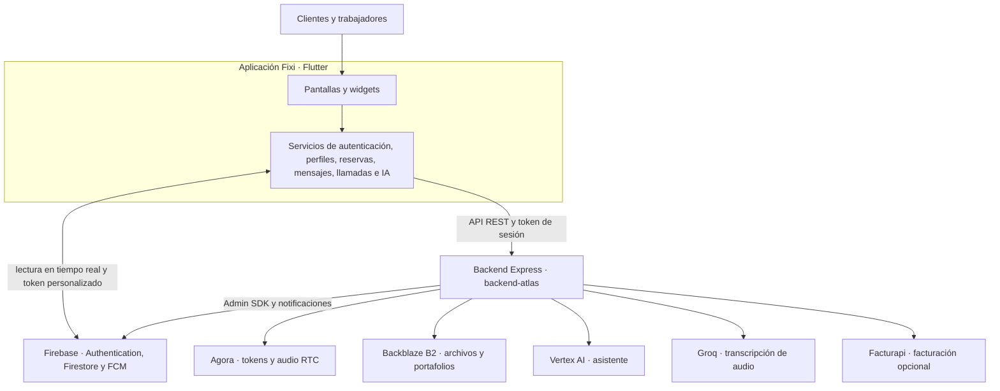

# Fixi

> Plataforma para conectar clientes con trabajadores independientes, creada como propuesta para **Hackatec 2026 — etapa local**.

Fixi responde al reto **Ecosistemas de Desarrollo** con una propuesta enfocada en el **apoyo a trabajos informales**. La aplicación ayuda a descubrir servicios, construir perfiles profesionales, coordinar reservas y mantener la comunicación entre ambas partes desde una misma experiencia.

> **Nota sobre el nombre:** durante el desarrollo, el proyecto utilizó **Atlas** como nombre clave temporal. **Fixi** es su nombre público y definitivo.

## Ficha del proyecto

| Campo | Información |
| --- | --- |
| Evento | Hackatec 2026 — etapa local |
| Reto | Ecosistemas de Desarrollo |
| Temática | Apoyo a trabajos informales |
| Equipo | Ojo de Prolog |
| Asesor | Docente Martin Oswaldo Valdes Alvarado |
| Líder | David Uriel Palacios Santillano |
| Integrantes | Beckhan Rivaldo Hernandez Bustos, Rubi Alejandrina Reyes Ruelas, Edwin Jose Lopez Gallegos y Josue Zarate Mijares |

## ¿Qué hace Fixi?

Fixi plantea un ecosistema digital para dar mayor visibilidad y herramientas de gestión a trabajadores independientes.

- Clientes y trabajadores pueden crear cuentas y administrar su perfil.
- Los clientes pueden buscar trabajadores por nombre o categoría, consultar perfiles públicos y portafolios, y solicitar servicios.
- Las reservas incluyen calendario, actualización de estado, confirmación de pago y calificaciones al terminar el servicio.
- Ambas partes cuentan con mensajería y llamadas de voz en tiempo real para coordinarse.
- Los trabajadores pueden subir imágenes y archivos para presentar sus servicios.
- El laboratorio integra un asistente de IA, transcripción de audio y funciones de facturación opcionales.

Las llamadas de voz requieren Android o iOS; la versión web sirve para explorar los demás flujos de la aplicación.

## Arquitectura



El cliente Flutter concentra la interfaz y los servicios de aplicación. El backend Express valida la sesión, aplica la lógica de negocio y accede a los proveedores con credenciales de servidor. Firestore se usa para lecturas en tiempo real autorizadas de conversaciones y llamadas; las operaciones sensibles se canalizan por el backend.

## Estructura del repositorio

```text
lib/
  Pantallas/       # Flujos de cliente, trabajador, chat, reservas y llamadas
  Servicios/       # API, autenticación, Firebase, IA, almacenamiento y más
  modelos/          # Modelos de dominio de la aplicación
  widgets/          # Componentes compartidos y adaptadores de plataforma
backend-atlas/
  prueba.js         # API Express y conexión con servicios externos
  package.json      # Dependencias y script de inicio del backend
firestore.rules     # Reglas de acceso de Firestore
docs/               # Documentación complementaria
```

## Tecnologías

- **Cliente:** Flutter y Material 3.
- **Backend:** Node.js, Express y Firebase Admin SDK.
- **Datos y notificaciones:** Firebase Authentication, Cloud Firestore y Firebase Cloud Messaging.
- **Llamadas:** Agora RTC.
- **Archivos:** Backblaze B2 mediante API compatible con S3.
- **Funciones complementarias:** Vertex AI, Groq y Facturapi.

## Ejecutar el proyecto localmente

### Requisitos

- Flutter estable compatible con Dart `^3.11.0`.
- Node.js 20 o superior y npm.
- Un proyecto Firebase propio. Consulta la [guía de configuración de Firebase](docs/configuracion-firebase.md).
- Credenciales propias de los proveedores que se quieran habilitar.

Para usar el asistente, habilita Vertex AI en el proyecto de Google Cloud asociado y concede a la cuenta de servicio el acceso correspondiente. La transcripción, el almacenamiento, las llamadas y la facturación también requieren la configuración de sus respectivos proveedores.

> No uses las configuraciones, claves ni cuentas de servicio de otra persona. El repositorio está diseñado para que cada instalación configure su propia infraestructura.

### 1. Preparar el backend

Instala las dependencias y crea `backend-atlas/.env`. Este archivo ya está ignorado por Git.

```bash
cd backend-atlas
npm ci
```

El backend lee las siguientes variables. Los nombres se muestran como contrato de configuración; sustituye los marcadores por valores propios y nunca los publiques.

| Grupo | Variables | Uso |
| --- | --- | --- |
| Inicio del servidor | `FIREBASE_SERVICE_ACCOUNT`, `GROQ_BASE_URL`, `GROQ_MODEL`, `VERTEX_MODEL` | Requeridas por la inicialización actual del backend. |
| Autenticación y datos | `FIREBASE_API_KEY` | Registro e inicio de sesión mediante Firebase. |
| Almacenamiento | `B2_ENDPOINT`, `B2_REGION`, `B2_KEY_ID`, `B2_APPLICATION_KEY`, `B2_BUCKET_NAME`, `B2_PUBLIC_BASE_URL` | Subida y publicación de archivos. |
| Llamadas | `AGORA_APP_ID`, `AGORA_APP_CERTIFICATE` | Generación de tokens RTC. |
| IA y transcripción | `VERTEX_PROJECT_ID`, `VERTEX_LOCATION`, `GROQ_API_KEY` | `VERTEX_PROJECT_ID` puede derivarse de la cuenta de servicio; `VERTEX_LOCATION` usa `us-central1` si se omite. |
| Facturación | `FACTURAPI_API_KEY` o `FACTURAPI_SECRET_KEY`, `FACTURAPI_BASE_URL` | Solo para las rutas de Facturapi. |
| Puerto | `PORT` | Opcional; usa `3000` por defecto. |

Como referencia, tu archivo local tendrá esta forma:

```dotenv
FIREBASE_SERVICE_ACCOUNT='<JSON de cuenta de servicio en una sola línea>'
FIREBASE_API_KEY='<firebase-web-api-key>'

B2_ENDPOINT='<endpoint-s3>'
B2_REGION='<region>'
B2_KEY_ID='<key-id>'
B2_APPLICATION_KEY='<application-key>'
B2_BUCKET_NAME='<bucket>'
B2_PUBLIC_BASE_URL='<public-base-url>'

AGORA_APP_ID='<app-id>'
AGORA_APP_CERTIFICATE='<app-certificate>'

GROQ_API_KEY='<groq-api-key>'
GROQ_BASE_URL='<groq-base-url>'
GROQ_MODEL='<transcription-model>'

VERTEX_PROJECT_ID='<google-cloud-project-id>'
VERTEX_LOCATION='us-central1'
VERTEX_MODEL='<vertex-model>'

FACTURAPI_API_KEY='<optional-facturapi-key>'
PORT=3000
```

Inicia el backend y confirma que esté disponible:

```bash
npm start
curl http://localhost:3000/status
```

### 2. Conectar y ejecutar Flutter

La URL del backend está centralizada en [`lib/Servicios/configBackend.dart`](lib/Servicios/configBackend.dart). Para desarrollo web local, cambia temporalmente `urlBase` a `http://localhost:3000`; no uses esa dirección para publicar una versión de producción.

Después, desde la raíz del repositorio:

```bash
flutter pub get
flutter run -d chrome --dart-define=AGORA_APP_ID=<tu-agora-app-id>
```

`AGORA_APP_ID` es necesario únicamente para llamadas. Para probar un backend local desde Android o un dispositivo físico, usa una URL HTTPS accesible para el dispositivo (por ejemplo, un túnel de desarrollo) o configura la seguridad de red del entorno de desarrollo; la configuración de producción usa HTTPS.

## Verificaciones útiles

Desde la raíz del repositorio:

```bash
dart analyze lib
```

Desde `backend-atlas`:

```bash
npm ci --dry-run
```

Los diagnósticos de análisis que ya existan en el proyecto no se corrigen mediante esta documentación; revísalos por separado antes de una entrega de producción.

## Seguridad y privacidad

- No subas `backend-atlas/.env`, cuentas de servicio de Firebase, certificados de Agora ni claves de proveedores.
- Genera y restringe credenciales para cada entorno; rota cualquier secreto que se haya compartido por accidente.
- Los archivos, mensajes, audios y solicitudes de IA pueden circular por proveedores externos configurados por quien despliega el sistema. Evalúa sus políticas de privacidad y solicita consentimiento cuando corresponda.
- Aplica las reglas de [`firestore.rules`](firestore.rules) en tu propio proyecto Firebase antes de probar funciones en tiempo real.

## Documentación adicional

- [Configuración de Firebase](docs/configuracion-firebase.md)
- [Guía breve anterior](docs/Leeme.md)
